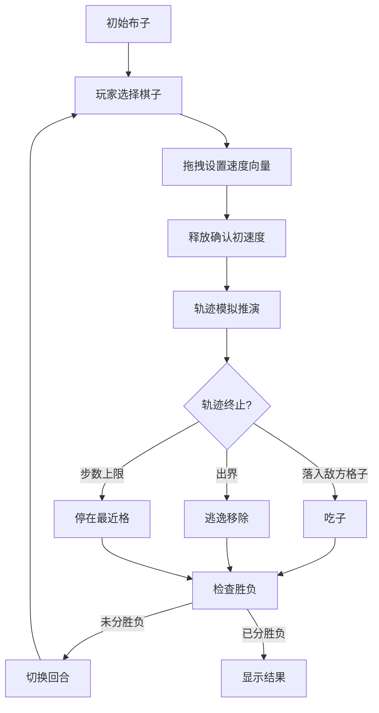

# 引力弹弓棋 · 玩法测试原型 PRD

## 1. 产品概述

引力弹弓棋是一款基于牛顿万有引力物理引擎的回合制策略游戏。玩家通过给棋子施加初速度，利用引力场（恒星+双方棋子）实现弹弓加速、轨道偏转，最终吃掉敌方棋子或使其逃逸出界。

- **核心目的**：验证"引力弹弓"核心机制的可玩性与手感
- **目标用户**：桌游/策略游戏爱好者
- **产品定位**：玩法验证原型（非完整游戏）

## 2. 核心功能

### 2.1 用户角色

| 角色 | 说明 |
|------|------|
| 玩家A（蓝方） | 控制左侧5枚棋子 |
| 玩家B（红方） | 控制右侧5枚棋子（Prototype中为演示AI） |

### 2.2 功能模块

| 模块 | 功能描述 |
|------|----------|
| 棋盘渲染 | 9×9网格，中心恒星，自由布子 |
| 速度输入 | 点击己方棋子 → 拖拽方向 → 释放设置初速度 |
| 轨迹模拟 | 实时显示预测轨迹，含引力计算 |
| 回合推进 | 玩家行动 → 轨迹推演 → 吃子判定 → 切换回合 |
| 胜负判定 | 吃光/逃逸/20回合质量判定 |

### 2.3 页面详情

**单一页面游戏界面**
- 棋盘区域（Canvas渲染）
- 速度向量指示器（拖拽交互）
- 当前回合指示
- 简要状态栏（剩余棋子、回合数）
- 重置按钮

## 3. 核心流程

## 4. 用户界面设计

### 4.1 设计风格

- **主题**：深空主题 + 霓虹轨道线
- **背景**：深蓝至黑渐变星空
- **主色**：
  - 蓝方棋子：`#4FC3F7`（天蓝）
  - 红方棋子：`#FF7043`（橙红）
  - 恒星：`#FFD54F`（金黄）+ 发光效果
  - 轨迹线：`#80CBC4`（青绿）
- **字体**：Orbitron（标题）、Roboto Mono（数据）
- **布局**：单页居中棋盘，四周留黑

### 4.2 视觉元素

| 元素 | 样式 |
|------|------|
| 棋盘格 | 半透明网格线，深色背景 |
| 恒星 | 放射状光晕 + 脉冲动画 |
| 棋子 | 圆球体，大小随质量变化 |
| 轨迹 | 虚线+渐隐，预测点连成曲线 |
| 速度向量 | 箭头指示器，拖拽时实时更新 |

### 4.3 响应式

- 桌面优先（最小宽度800px）
- Canvas自适应容器大小
- 移动端暂不支持（需大屏操作）

## 5. 物理参数配置

| 参数 | 值 | 说明 |
|------|-----|------|
| G | 0.5 | 万有引力常数 |
| Δt | 0.1 | 推演时间步 |
| 最大步数 | 200 | 单次轨迹推演上限 |
| r_min | 1.5 | 恒星洛希极限 |
| 恒星质量 | 20 | 中心恒星 |
| 速度上限 | 3/5 | 正常/弹弓状态 |

## 6. 验收标准

- [ ] 棋盘正确渲染9×9网格和中心恒星
- [ ] 双方各5枚棋子可自由布子在第1/9行
- [ ] 拖拽设置速度向量后轨迹预测显示
- [ ] 引力计算正确（F = GMm/r²）
- [ ] 轨迹推演终止条件正确（落地/出界/步数上限）
- [ ] 吃子判定正确
- [ ] 胜负判定正确
- [ ] 回合切换正常
- [ ] 视觉风格符合深空主题
